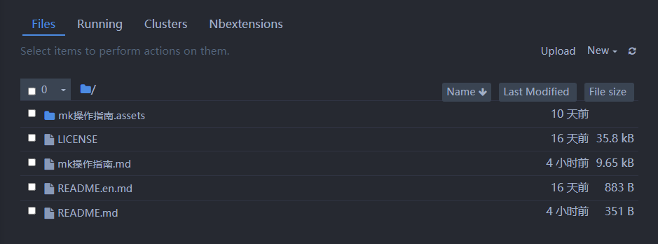
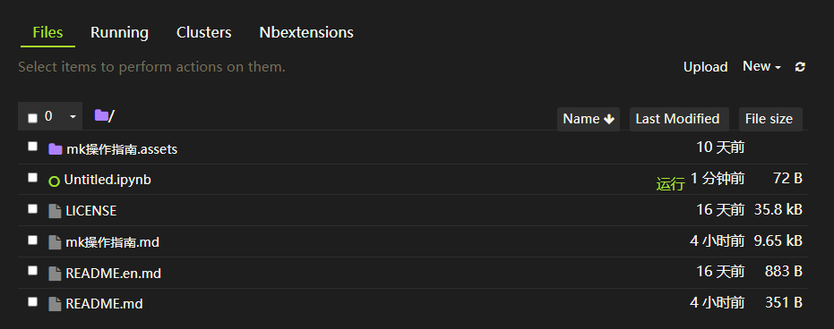
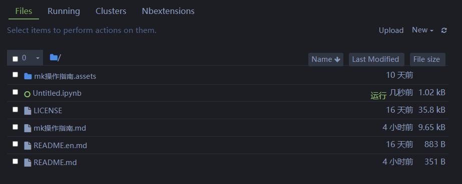
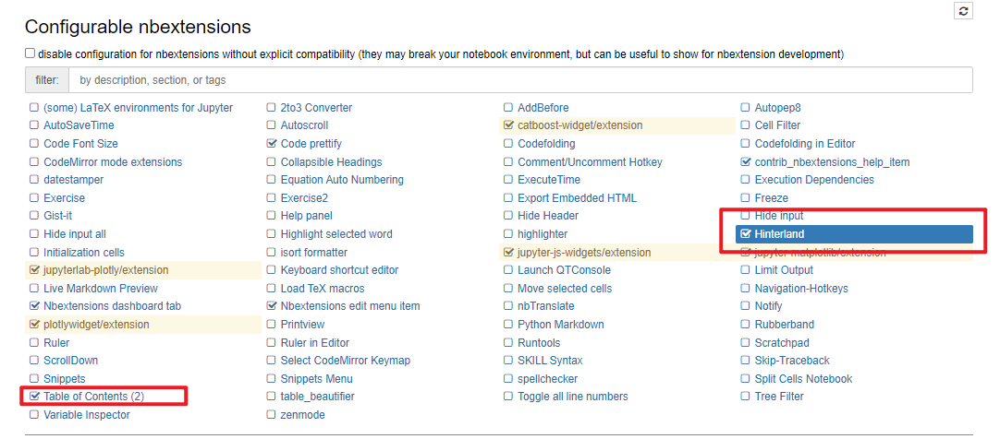

**git push gitee-interpreter master **

# Jupyter Notebook

## 主题更换

Jupyter Notebook 的默认主题是白色背景的，简洁大方，便于使用。但是在长时间使用默认界面后觉得亮瞎…… 无比怀念类似Pycharm 或vs code 中设置的黑色界面…

解决办法：jupyterthemes 库 

地址：https://github.com/dunovank/jupyter-themes

==个人感想，新主题挺好，但是很多功能都没有了【代码调整等，所以我还是用回去了】==

### 安装&使用

```python
# 利用豆瓣地址开始下载：
pip install -i https://pypi.doubanio.com/simple/ jupyterthemes

# 查看可用主题
jt -l
结果：
Available Themes:
   chesterish
   grade3
   gruvboxd
   gruvboxl
   monokai
   oceans16
   onedork
   solarizedd
   solarizedl

# 设置主题：
jt -t oceans16

# 回复默认主题
jt -r
```







### 我的主题设置参数

==具体还是去git查看说明文档==

我的monikai 主题设置的详细参数如下：

```python
jt -t monokai -f roboto -nf robotosans -tf robotosans -N -T -cellw 70% -dfs 10 -ofs 10
```

#### Description of Command Line options

| cl options            | arg     | default |
| --------------------- | ------- | ------- |
| Usage help            | -h      | --      |
| List Themes           | -l      | --      |
| Theme Name to Install | -t      | --      |
| Code Font             | -f      | --      |
| Code Font-Size        | -fs     | 11      |
| Notebook Font         | -nf     | --      |
| Notebook Font Size    | -nfs    | 13      |
| Text/MD Cell Font     | -tf     | --      |
| Text/MD Cell Fontsize | -tfs    | 13      |
| Pandas DF Fontsize    | -dfs    | 9       |
| Output Area Fontsize  | -ofs    | 8.5     |
| Mathjax Fontsize (%)  | -mathfs | 100     |
| Intro Page Margins    | -m      | auto    |
| Cell Width            | -cellw  | 980     |
| Line Height           | -lineh  | 170     |
| Cursor Width          | -cursw  | 2       |
| Cursor Color          | -cursc  | --      |
| Alt Prompt Layout     | -altp   | --      |
| Alt Markdown BG Color | -altmd  | --      |
| Alt Output BG Color   | -altout | --      |
| Style Vim NBExt*      | -vim    | --      |
| Toolbar Visible       | -T      | --      |
| Name & Logo Visible   | -N      | --      |
| Kernel Logo Visible   | -kl     | --      |
| Reset Default Theme   | -r      | --      |
| Force Default Fonts   | -dfonts | --      |

#### Fonts

##### Monospace Fonts (code cells)

| -f arg      | Monospace Font           |
| ----------- | ------------------------ |
| anka        | Anka/Coder               |
| anonymous   | Anonymous Pro            |
| aurulent    | Aurulent Sans Mono       |
| bitstream   | Bitstream Vera Sans Mono |
| bpmono      | BPmono                   |
| code        | Code New Roman           |
| consolamono | Consolamono              |
| cousine     | Cousine                  |
| dejavu      | DejaVu Sans Mono         |
| droidmono   | Droid Sans Mono          |
| fira        | Fira Mono                |
| firacode    | Fira Code                |
| generic     | Generic Mono             |
| hack        | Hack                     |
| hasklig     | Hasklig                  |
| inconsolata | Inconsolata-g            |
| inputmono   | Input Mono               |
| iosevka     | Iosevka                  |
| liberation  | Liberation Mono          |
| meslo       | Meslo                    |
| office      | Office Code Pro          |
| oxygen      | Oxygen Mono              |
| roboto      | Roboto Mono              |
| saxmono     | saxMono                  |
| source      | Source Code Pro          |
| sourcemed   | Source Code Pro Medium   |
| sudovar     | Sudo Variable            |
| ptmono      | PT Mono                  |
| ubuntu      | Ubuntu Mono              |

##### Sans-Serif Fonts

| -nf/-tf arg | Sans-Serif Font |
| ----------- | --------------- |
| opensans    | Open Sans       |
| droidsans   | Droid Sans      |
| exosans     | Exo_2           |
| latosans    | Lato            |
| ptsans      | PT Sans         |
| robotosans  | Roboto          |
| sourcesans  | Source Sans Pro |

##### Serif Fonts

| -nf/-tf arg  | Serif Font       |
| ------------ | ---------------- |
| loraserif    | Lora             |
| ptserif      | PT Serif         |
| georgiaserif | Georgia          |
| cardoserif   | Cardo            |
| crimsonserif | Crimson Text     |
| ebserif      | EB Garamond      |
| merriserif   | Merriweather     |
| neutonserif  | Neuton           |
| goudyserif   | Sorts Mill Goudy |

## 自动补全代码

本次要介绍的两个功能是：

（1）针对jupyter notebook 中的Markdown 文件自动生成目录
（2）自动补全代码

都是由python 的一个jupyter 扩展插件Nbextensions 库来实现。

### 安装及使用

```python
# 安装库
python -m pip install jupyter_contrib_nbextensions
# 执行
jupyter contrib nbextension install --user --skip-running-check
```

安装完成后，勾选Table of Contents 以及Hinterland。其中Hinterland 是用来自动补全代码的，这个拓展的代码补全功能虽然没有PyCharm 中的那么全面，但比没有是要好多了。设置如下：




# Anaconda

1. 全局指令

   ```python
   # 全局 虚拟环境安装
   conda create -n py36 python=3.6
   
   # 查看帮助文档
   conda create --help
   
   # 激活全局命令 
   conda create env_name
   
   # 退出
   conda deactivate env_name
   
   # 来查看已安装好的虚拟环境下都安装了那些python 库
   conda list
   
   ```

   发现已安装好的虚拟环境py36 下只安装了少量的基本库，如果也想用3.6 版来进行科学计算，需要安装许多其他的库，如果一个一个安装，则会费时费力，而且容易出错，这时anaconda 提供了一个命令，可以把基于python3.6版本的anaconda 中的其他库一次安装好，命令如：

   ```python
   conda install -prefix=D:\pyenv\py36 anaconda
   ```

   请特别注意，全部安装时，安装包会很多，安装时间比较长，同时占用安装空间也会比较大，请根据自己的需求选择是否安装。参考时间：安装py36 全部的库花了大概1 个多小时。

2. 局部环境指令

   ```python
   # 安装虚拟环境到指定路径的命令
   conda create --prefix=D:\python36\py36 python=3.6
   上面的命令中，路径D:\python36 是先建好的文件夹，py36 是需要安装的虚拟环境名称。请注意，安装完成后，虚拟环境的全称包含整个路径，为D:\python36\py36 。激活指定路径下的虚拟环境的命令如下
   
   # 激活指定路径下的虚拟环境的命令如下：
   activate D:\python36\py36
       
   # 想要删除指定路径下的虚拟环境，使用如下的命令
   conda remove --prefix=D:\python36\py36 --all
   ```

   

3. 特殊工艺

   当然了，有一些库不论conda 和pip
   都无法直接安装，只能下载.whl 进行安装。

4. waited

```python

```
